# Luxify

## Home Slider

```css title="Home Slider"
.home_slider_slide {
}

.home_slider_card {
}
```

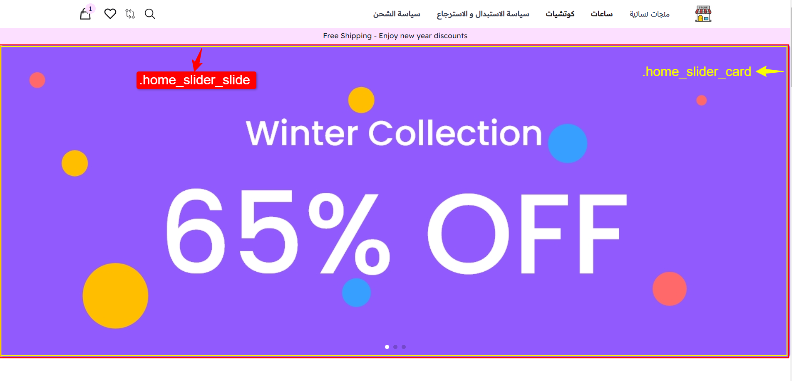

## Home section title

```css
.home_section_top_container {
}

.home_section_top_title {
}
```

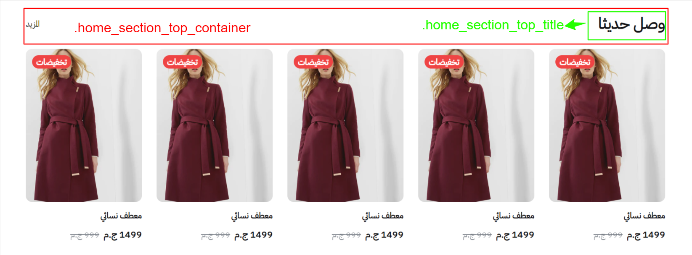

## Category Card

```css
.luxify_category_card {
}

.luxify_category_card_img {
}

.luxify_category_card_name {
}
```

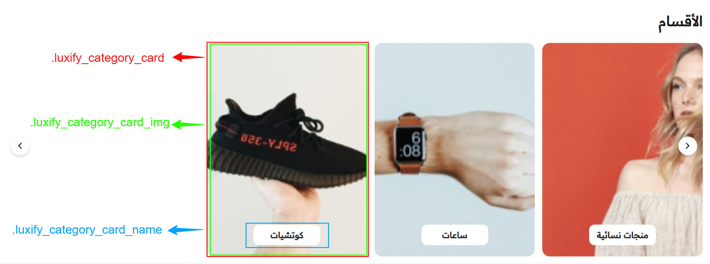

## Featured Card

```css
.luxify_product_featured_container {
}

.luxify_product_featured_category_card {
}

.luxify_product_featured_card {
}

.luxify_product_featured_card_img {
}
```

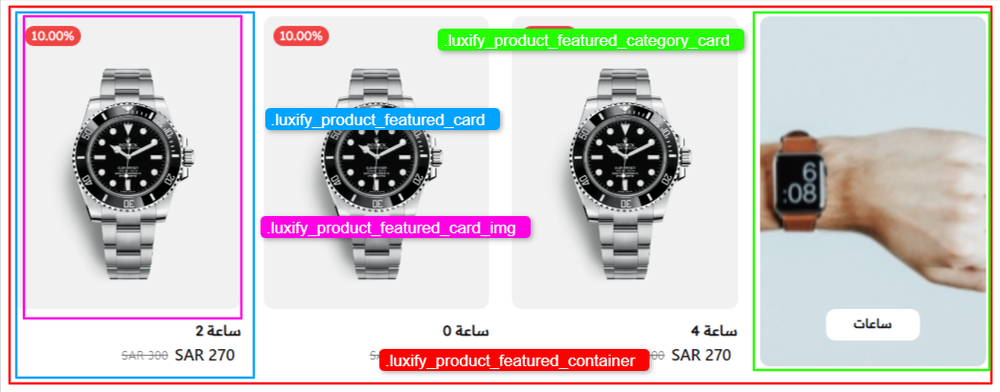

## Home product carousel

```css
.home_products_carousel_card {
}
```

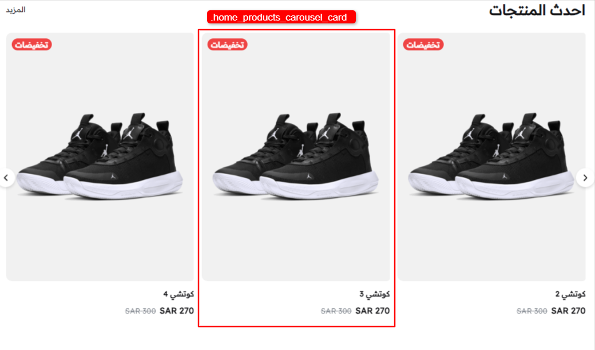

## Home products grid

```css
.home_products_grid_container {
}

.home_products_grid_card {
}
```

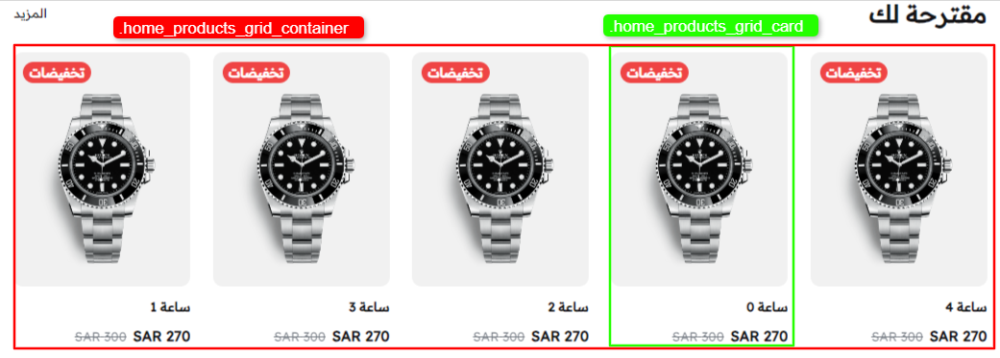

## Home banner

```css
.home_banner {
}

.home_banner_img {
}
```

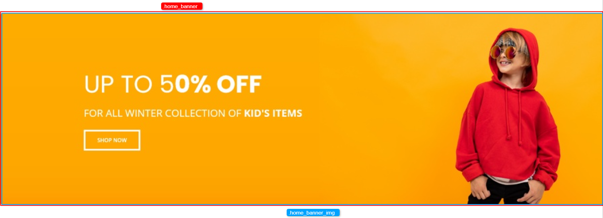

## Product page

### Product name

```css
.product_name {
}
```

### Product price

```css
.product_price_container {
}

.product_price {
}
```


### Product description

```css
.product_description {
}
```

### Product image

```css
.luxify_product_active_img {
}

.luxify_product_images_grid {
}

.luxify_product_images_grid_img {
}
```

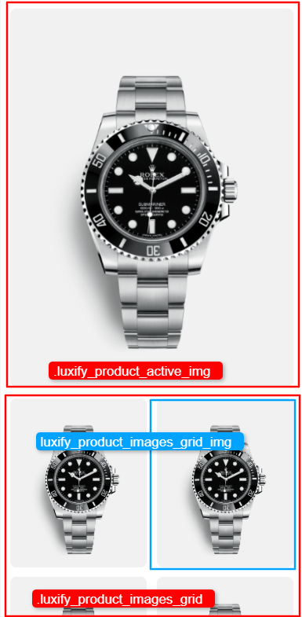

## Buttons

### Checkout button and add to cart button

```css
.checkout_btn {
}

.add_to_cart_btn {
}
```

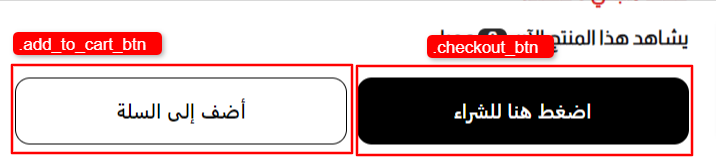

### Form button

```css
.form_checkout_btn {
}
```


### Quantity button

```css
.quantity_container {
}

.quantity_btn {
}
```

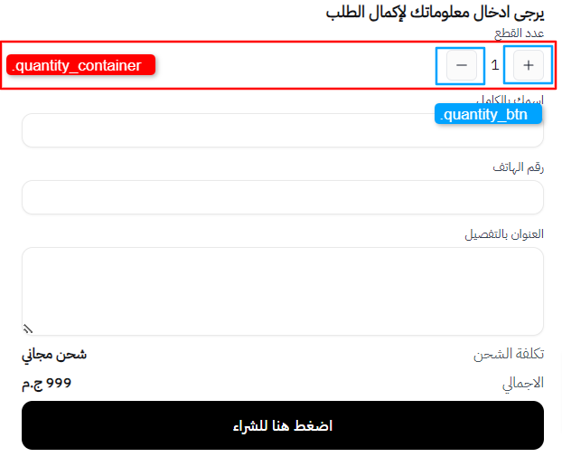

## Product form checkout

```css
.product_form_checkout {
}
```

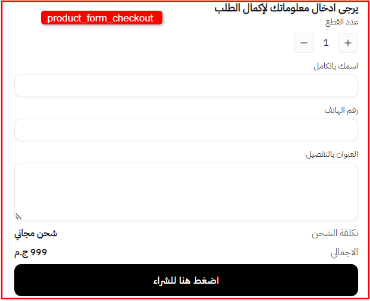

## Total shipping cost

```css
.total_shipping_container {
}

.total_shipping {
}
```


## Total price

```css
.total_price_container {
}

.total_price {
}
```

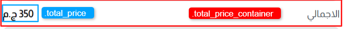

## Category page

### Category section header

```css
.category_section_header {
}

.category_section_header_title {
}
```


### Category products grid

```css
.category_products_grid_container {
}

.category_products_grid_card {
}
```

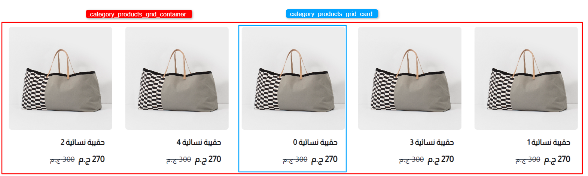

## Global

### Header

```css
.luxify_header {
}
```


```css
.luxify_header_container {
}
```


```css
.luxify_top_header {
}
```


```css
.luxify_header_logo {
}
```


```css
.luxify_bottom_text {
}
```


### Footer

```css
.luxify_footer {
}

.luxify_footer_links_container {
}

.luxify_footer_link {
}

.luxify_footer_social_container {
}

.luxify_footer_social_link {
}

.footer_store_info {
}
```

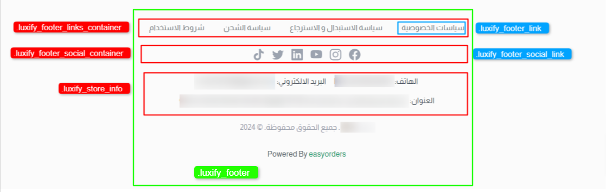

### Slider

:::info
The following classes are used for the global slider component so every slider in the theme will have the same style.
:::

```css
.swiper-pagination {
}

.swiper-pagination-bullet {
}

.swiper-pagination-bullet-active {
}

.slider_buttons_container {
}

.slider_button {
}
```

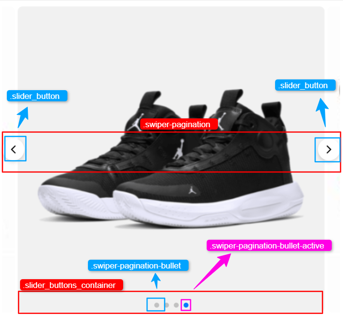

